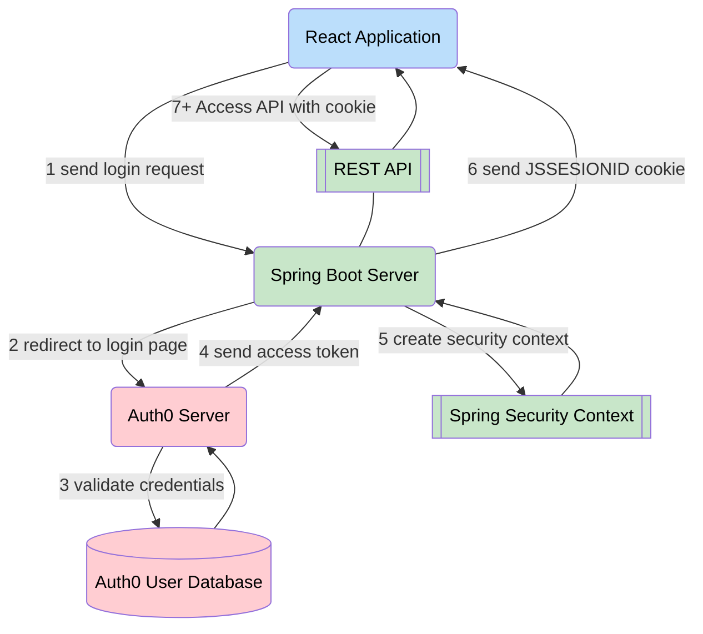

# Readme

# Features

## Oauth2 Authorization Code Flow

Oauth2 Authorization Code Flow implemented with Java Spring oauth2.



React application context does not contain any secrets


- Complex and peformant interaction with PostgreSQL database via native SQL and ORM (Spring Data JPA)
- Security and users session via Spring Security


# ENV / REPO Notes
This is a monorepo containing the frontend, backend, and DB projects for ease of viewing. Development of each component took part largely in individual repositories. 

## Secret Files
The following files are not kept in the repo for security purposes and will need to be replaced:

- (self) Signed SSL cert needed in ```backend/src/main/resources``` directory. Update in application.yaml under server.ssl

- Config file _secrets.yaml_ in the ```backend/src/main/resources``` directory.
  - _secrets.yaml_ should contain following:
    - auth0-issuer: _Domain of authentication server_
    - auth0-secret: _Secret for auth server_
    - auth0-cid: _Client ID (specific application ID for auth0)_
    - key-sign: _Password for SSL cert_
